# 📉 Telco Customer Churn


An end-to-end churn analytics capstone project covering exploratory data analysis, feature engineering, predictive modeling, threshold selection, and business-value sensitivity analysis for customer retention.

## 📋 Project Overview

This project builds a customer churn prediction workflow on a telecom-style customer dataset with 7,043 customer records. The EDA notebook works from the raw 50-column dataset, while the modeling notebook uses a processed 55-column dataset that includes engineered features such as `tenure_duration`, `revenue_per_month`, `revenue_per_month_missing`, `revenue_deviation`, and `revenue_deviation_missing`.

The modeling workflow compares multiple classifiers, evaluates them with both ranking and classification metrics, and translates predictions into an intervention-based business scenario. After hyperparameter tuning, CatBoost is selected as the best model on the validation set, achieving ROC-AUC 0.9006, PR-AUC 0.7738, precision 0.7275, recall 0.6711, F1-score 0.6982, balanced accuracy 0.7902, and Brier score 0.1096.

Models generated can save up to \$1,192,790.00 (CLTV) and up to \$502,714.06 (Total Revenue), as can be seen in the business simulation section.

---

## 📚 Table of Contents
- [Required Libraries](#-required-libraries)
- [Project Structure](#-project-structure)
- [Reproducing the project](#-reproducing-the-project)
- [Usage](#-usage)
- [Problem Statement](#-problem-statement)
- [Objectives](#-objectives)
- [Dataset Summary](#-dataset-summary)
- [Exploratory Analysis Highlights](#-exploratory-analysis-highlights)
- [Feature Engineering](#-feature-engineering)
- [Modeling Pipeline](#-modeling-pipeline)
- [Model Comparison](#-model-comparison)
- [Threshold Analysis](#-threshold-analysis)
- [Business Interpretation](#-business-interpretation)
- [Visual Highlights](#-visual-highlights)
- [Key Takeaways](#-key-takeaways)
- [License](#-license)
- [About the Author](#-author)
- [Acknowledgements](#-acknowledgments)
- [References](#-references)

---

## 🛠️ Required Libraries
This project relies on the following core Python libraries:
* **Python**: Version 3.8+
* **NumPy**: For numerical matrix operations. `pip install numpy`
* **Pandas**: For tabular data manipulation. `pip install pandas`
* **Matplotlib**: For foundational plotting. `pip install matplotlib`
* **Seaborn**: For aesthetic statistical visualizations. `pip install seaborn`
* **Plotly**: For interactive visualizations. `pip install plotly`
* **Scikit-learn**: For preprocessing, metrics and modeling. `pip install scikit-learn`
* **SciPy**: For associations and chi square analysis. `pip install scipy`
* **XGBoost**: Extreme Gradient Boost, for modeling. `pip install xgboost`
* **CatBoost**: Cat Boost, for modeling. `pip install catboost`
* **SHAP**: For statistical explanation of features. `pip install shap`
* **pySankey**: For plotting churn components. `pip install pysankey`
* **Jupyter**: For interactive data exploration and analysis. `pip install jupyter`

> For easier installation of the required libraries, refer to requirements.txt.

---

## 📁 Project Structure

```text
Telco-Customer-Churn/
├── data/
│   ├── raw.csv                            # Raw data from Kaggel
│   └── processed.csv                      # Feature engineered data
├── images/                                # Output folder for generated visualizations
│   ├── business_sensitivity_cltv.svg
│   ├── business_sensitivity_revenue.svg
│   ├── churn_captured.svg
│   ├── churn_contract.svg
│   ├── churn_offer.svg
│   ├── churn_prop.svg
│   ├── confusion_matrix.svg
│   ├── missing_values.svg
│   ├── model_comparison.svg
│   ├── shap_summary.svg
│   └── threshold_tradeoff.svg
├── notebooks/
│   ├── catboost_info                      # Folder made from running the catboost model
│   ├── eda_feat_engg.ipynb                # Notebook for EDA and Feature Engineering
│   └── model_eval.ipynb                   # Notebook for Modeling and Evaluation
├── LICENSE                            # License file
├── README.md                              # This documentation file
└── requirements.txt                       # Dependency list
```

---

## 🚀 Reproducing the Project

### 1. Clone the repository

```bash
git clone https://github.com/your-username/Telco-Customer-Churn.git
cd Telco-Customer-Churn
```

### 2. Create a virtual environment
On Mac:

```bash
python -m venv .venv
source .venv/bin/activate
```

On Windows:

```bash
.venv\Scripts\activate
```

### 3. Install dependencies

```bash
pip install -r requirements.txt
```

### 4. Launch Jupyter

```bash
jupyter notebook
```

---

## 📊 Usage
The entire pipeline is contained within two notebooks. Open `notebooks/eda_feat_engg.ipynb` and `notebooks/model_eval.ipynb` in Jupyter Notebook or JupyterLab in this order and run all cells sequentially to reproduce the data cleaning, model training, hyperparameter tuning, composite scoring, and business simulation.

---

## 🎯 Problem Statement

Customer churn directly affects recurring revenue, customer lifetime value, and acquisition efficiency. The goal of this project is to predict which customers are at higher risk of churning and to translate model output into an operational retention strategy that can be tuned for contact cost and assumed retention effectiveness.

---

## 💡 Objectives

- Understand the churn target, missingness patterns, and feature relationships.
- Audit the dataset for leakage and define a realistic modeling feature set.
- Engineer a small number of interpretable features.
- Compare baseline and advanced classification models.
- Select a probability threshold based on validation trade-offs.
- Estimate business impact under different intervention assumptions.

---

## 📦 Dataset Summary

### Raw Dataset

The EDA notebook uses a raw dataset with 7,043 rows and 50 columns. It includes demographic, account, service, usage, billing, revenue, and churn-related fields such as `Churn Label`, `Churn Score`, `Churn Category`, and `Churn Reason`.

### Processed Dataset

The modeling notebook uses a processed dataset with 7,043 rows and 55 columns after feature engineering. The processed version adds `tenure_duration`, `revenue_per_month`, `revenue_per_month_missing`, `revenue_deviation`, and `revenue_deviation_missing`.

### Target Variable

The target is `Churn Label`, a binary outcome indicating whether the customer churned. The class balance shown in the EDA notebook is approximately 26.5% churned and 73.5% retained, which makes the problem moderately imbalanced and motivates the use of PR-AUC, recall, precision, and F1-score in addition to ROC-AUC.

### Key Data Quality Findings

The notebook identifies four columns with missing values in the raw dataset. `Churn Reason` and `Churn Category` each have 5,174 missing values (73.46%), `Offer` has 3,877 missing values (55.05%), and `Internet Type` has 1,526 missing values (21.67%). 

These gaps are not all the same kind of problem. `Churn Reason` and `Churn Category` are post-outcome variables that should not be used for prediction, while `Offer` and `Internet Type` are handled as ordinary modeling inputs with explicit preprocessing logic. 

### Leakage Policy

To keep the model realistic, the project excludes identifiers, explicit target fields, post-outcome fields, and high-granularity geography from predictive modeling. The notebooks explicitly discuss leakage risk around fields such as `Customer Status`, `Churn Score`, `Churn Category`, and `Churn Reason`, while still allowing some of them to remain available for descriptive analysis and business interpretation outside the model feature matrix.

---

## 📊 Exploratory Analysis Highlights

The EDA notebook shows several strong churn relationships among contract type, offer type, internet configuration, and payment method. For example, churn rates are 45.84% for month-to-month customers, 10.71% for one-year contracts, and 2.55% for two-year contracts. 

Offer type is also highly differentiated: customers with Offer E show 52.92% churn, compared with 26.74% for Offer D, 22.89% for Offer C, 12.26% for Offer B, and 6.73% for Offer A. These patterns suggest that contract stability and commercial packaging are closely associated with retention outcomes in this dataset.

The categorical association table supports those visual findings. `Contract` has the strongest Cramér’s V among the displayed features at 0.4527, followed by `Offer` at 0.3913, `Dependents` at 0.2479, `Internet Service` at 0.2272, `Payment Method` at 0.2184, and `Internet Type` at 0.2158.

### Selected Churn-Rate Views

| Feature | Segment | Churn rate |
|---|---|---:|
| Contract | Month-to-Month | 45.84% |
| Contract | One Year | 10.71% |
| Contract | Two Year | 2.55% |
| Offer | Offer E | 52.92% |
| Offer | Offer A | 6.73% |
| Internet Type | Fiber Optic | 40.72% |
| Internet Type | DSL | 18.58% |
| Payment Method | Mailed Check | 36.88% |
| Payment Method | Credit Card | 14.48% |
| Online Security | No | 31.33% |
| Online Security | Yes | 14.61% |

### Selected Cramérs V Associations

| Feature | Chi Square | DoF | P-value | Cramérs V |
|---|---:|---:|---:|---:|
| Contract | 1445.29 | 2 | 0.0 | 0.4527 |
| Offer | 488.64 | 4 | 1.92e-104 | 0.3013 |
| Dependents | 433.73 | 1 | 2.5e-96 | 0.2479 |
| Internet Service | 364.52 | 1 | 2.92e-81 | 0.2272 |
| Payment Method | 337.83 | 2 | 4.37e-74 | 0.2184 |
| Internet Type | 258.81 | 2 | 6.31e-57 | 0.2158 |

---

## 🤖 Feature Engineering

The processed dataset introduces five engineered variables intended to preserve interpretability while improving signal capture. These are tenure bucketing through `tenure_duration`, revenue intensity via `revenue_per_month`, and deviation or missing-indicator features for revenue-based calculations.

### Engineered Features

| Feature | Type | Description |
|---|---|---|
| `tenure_duration` | Categorical | Tenure band capturing customer lifecycle stage. |
| `revenue_per_month` | Numeric | Average revenue intensity per month. |
| `revenue_per_month_missing` | Binary | Indicator that revenue-per-month required fallback handling. |
| `revenue_deviation` | Numeric | Deviation between observed revenue behavior and a monthly-charge expectation. |
| `revenue_deviation_missing` | Binary | Indicator that deviation-based feature required fallback handling. |

---

## 🤖 Modeling Pipeline

The preprocessing pipeline applies median imputation and standard scaling to numeric columns, and constant-value imputation followed by one-hot encoding to categorical columns. This transformation is wrapped inside a scikit-learn `ColumnTransformer` and `Pipeline` so that preprocessing is learned only from the training split.

The train-validation-test strategy uses a 60/20/20 split with stratification. This preserves the churn ratio across data partitions and supports model selection on validation data before final reporting on the untouched test set.

### Candidate Models

| Family | Model |
|---|---|
| Linear | Logistic Regression |
| Tree-based | Decision Tree |
| Bagging | Random Forest |
| Boosting | AdaBoost |
| Boosting | Gradient Boosting |
| Gradient boosting | XGBoost |
| Gradient boosting | CatBoost |

---

## 🏆 Model Comparison

The cross-validation results show that CatBoost performs best overall on the displayed fold averages, with mean ROC-AUC 0.9119 and mean PR-AUC 0.7916. Gradient Boosting and Logistic Regression are close behind on both measures.

### Cross-Validation Summary

| Model | Mean ROC-AUC | Std ROC-AUC | Mean PR-AUC | Std PR-AUC |
|---|---:|---:|---:|---:|
| CatBoost | 0.9119  | 0.0095  | 0.7916  | 0.0315  |
| GradientBoost | 0.9104  | 0.0098  | 0.7880  | 0.0298  |
| LogisticRegression | 0.9053  | 0.0069  | 0.7747  | 0.0225  |
| AdaBoost | 0.9026  | 0.0112  | 0.7675  | 0.0336  |
| RandomForest | 0.8993  | 0.0100  | 0.7601  | 0.0359  |
| XGB | 0.8971  | 0.0105  | 0.7544  | 0.0319  |
| DecisionTree | 0.8634  | 0.0165  | 0.6402  | 0.0302  |

### Validation Summary (after Hyperparameter Tuning)

The validation results narrow the shortlist to CatBoost, Gradient Boosting, and Logistic Regression. CatBoost provides the best overall balance among discrimination, calibration, and classification trade-offs in the displayed table. 

| Model | ROC-AUC | PR-AUC | Precision | Recall | F1-score | Balanced accuracy | Brier score |
|---|---:|---:|---:|---:|---:|---:|---:|
| CatBoost | 0.9006  | 0.7738  | 0.7275  | 0.6711  | 0.6982  | 0.7902  | 0.1096  |
| Gradient Boosting | 0.8942  | 0.7595  | 0.7020  | 0.6551  | 0.6777  | 0.7773  | 0.1134  |
| Logistic Regression | 0.8933  | 0.7485  | 0.5552  | 0.8610  | 0.6751  | 0.8058  | 0.1445  |

---

## 📈 Threshold Analysis

The notebook includes a threshold sweep to make the intervention-volume trade-off explicit. Lower thresholds capture more churners but flag more customers, while higher thresholds improve precision at the cost of recall. In this project, the threshold analysis helps connect model quality to team capacity and operational decision-making rather than treating 0.50 as a fixed default.

- Precision — among predicted churners, how many actually churn?
- Recall — among actual churners, how many did we identify?
- F1 — balance between precision and recall
- ROC-AUC — ranking quality across classification thresholds
- PR-AUC — especially informative for an imbalanced positive class

### Threshold Trade-off excerpt

| Threshold | Precision | Recall | F1-score | Customers flagged | Flagged rate |
|---:|---:|---:|---:|---:|---:|
| 0.20 | 0.5253  | 0.8877  | 0.6600  | 632  | 0.4485  |
| 0.30 | 0.6051  | 0.8235  | 0.6976  | 509  | 0.3612  |
| 0.35 | 0.6394  | 0.8021  | 0.7117  | 469  | 0.3329  |
| 0.40 | 0.6620  | 0.7594  | 0.7073  | 429  | 0.3045  |
| 0.50 | 0.7275  | 0.6711  | 0.6982  | 345  | 0.2449  |
| 0.60 | 0.7695  | 0.5802  | 0.6616  | 282  | 0.2001  |

A practical deployment choice would depend on retention-team capacity, expected uplift from intervention, and the acceptable false-positive cost. The threshold table is valuable because it ties the pure model score to an operational policy decision. 

---

## 👔 Business Interpretation

The project also converts model predictions into retention simulations under different intervention assumptions, showing how expected savings vary with retention rate and contact cost for both CLTV- and revenue-based benefit views.

The sensitivity-analysis section evaluates net benefit against retention rate for fixed contact costs using `sensitivity_df`, which is also the basis for the Plotly line chart requested later in the workflow. That framing makes it possible to identify break-even points and test whether a model-led intervention remains attractive under more conservative assumptions. 

---

## 📊 Visual highlights

### Class balance

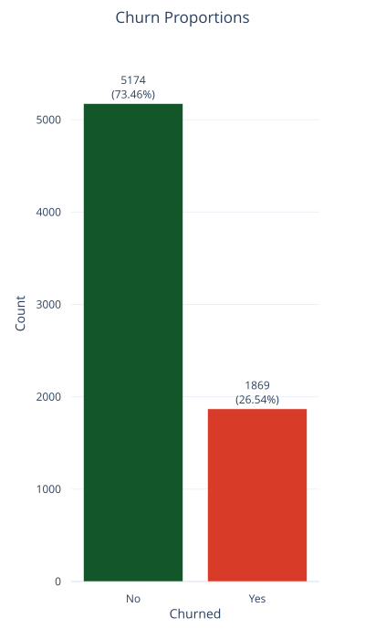
*Target distribution in the churn dataset.*

### Missing values
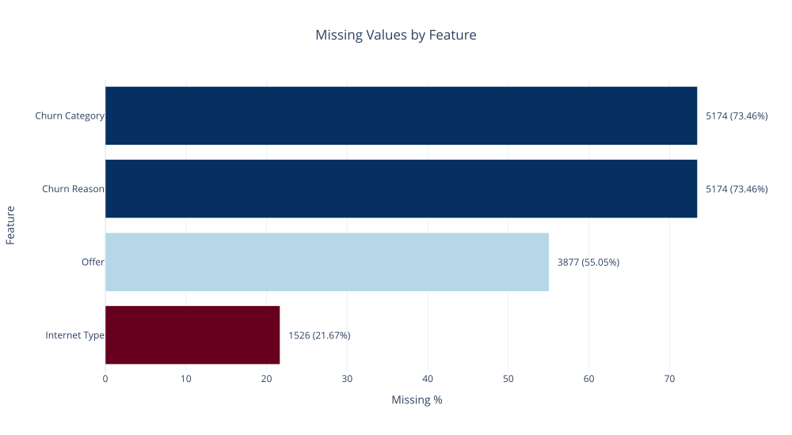
*Missingness across the main input variables.*

### Churn by Contract
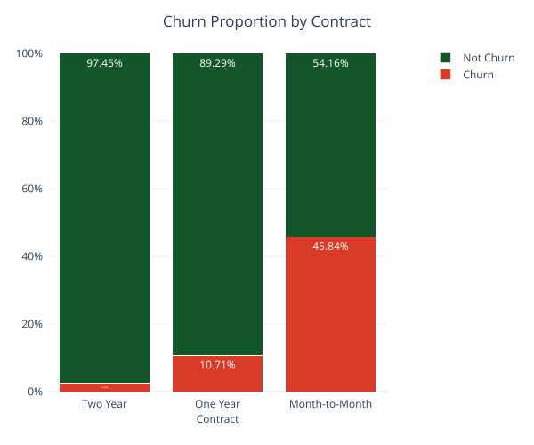
*Churn rate across customer contract types.*

### Churn by Offer
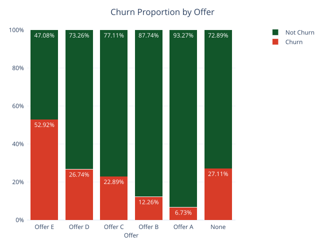
*Churn rate across commercial offer groups.*

### Model comparison
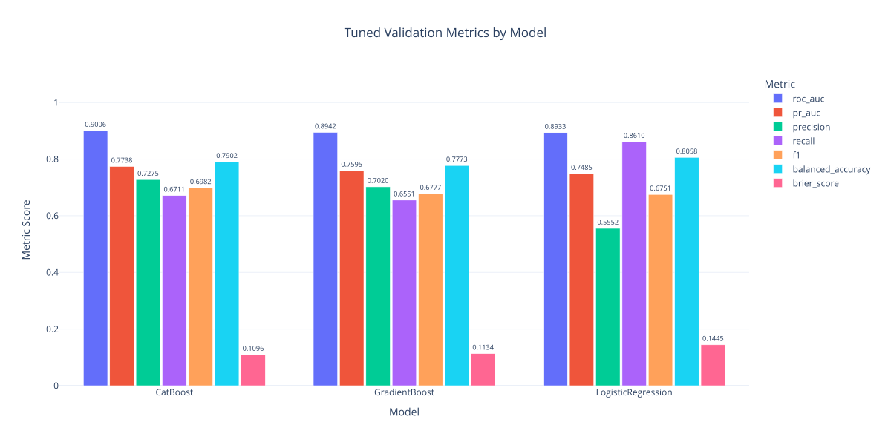
*Performance comparison of the shortlisted models.*

### Threshold trade-off
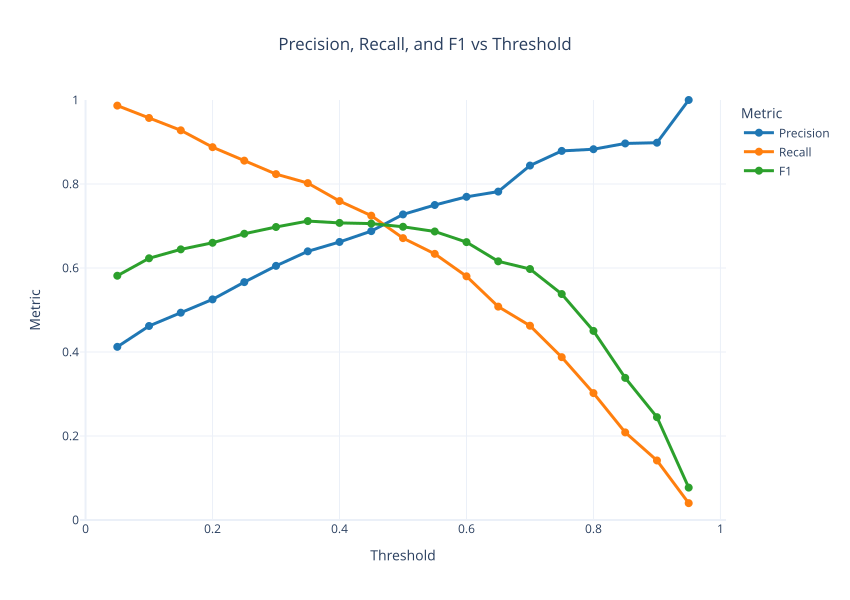
*Precision, recall, and F1-score across classification thresholds.*

### Confusion Matrix
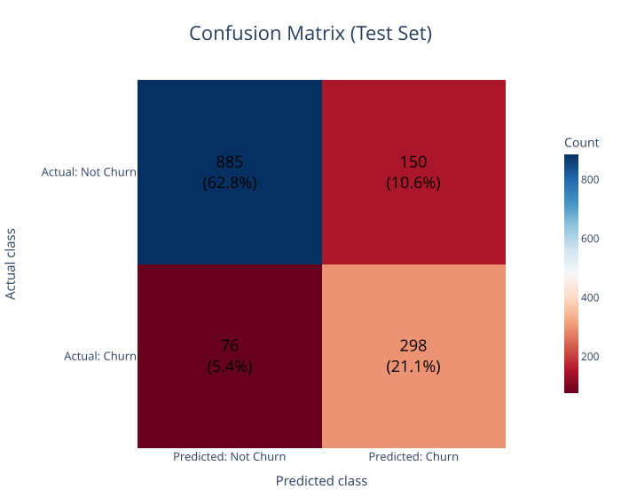
*Validation-set confusion matrix for the selected model (Tuned CatBoost).*

### SHAP summary
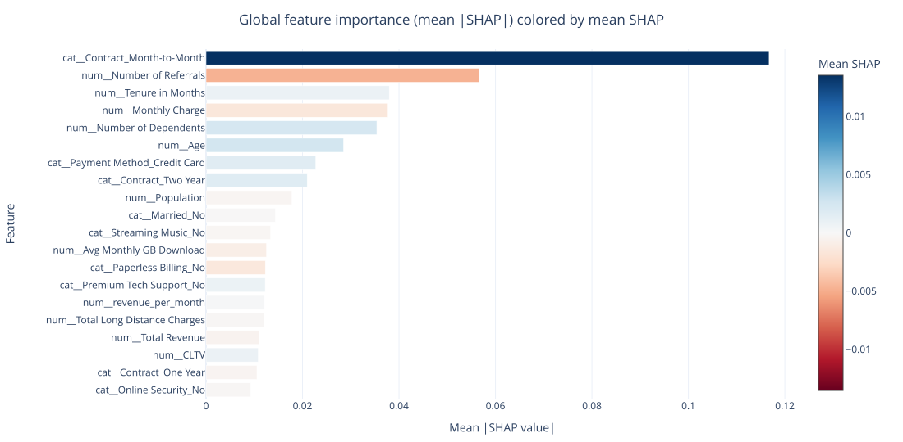
*Feature importance and direction of impact from SHAP values.*

### Business sensitivity
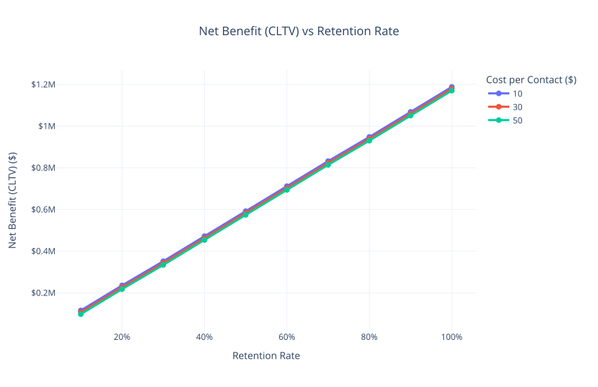
*Net benefit sensitivity under CLTV-based assumptions.*

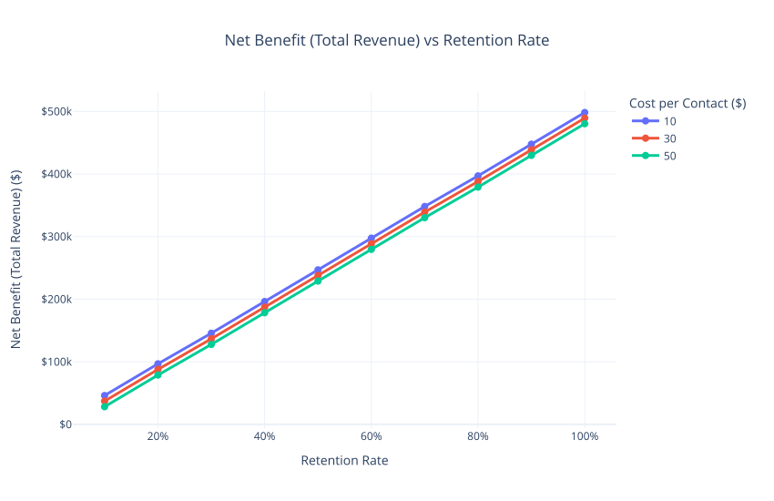
*Net benefit sensitivity under revenue-based assumptions.*

### Cumulative churn captured by modeling
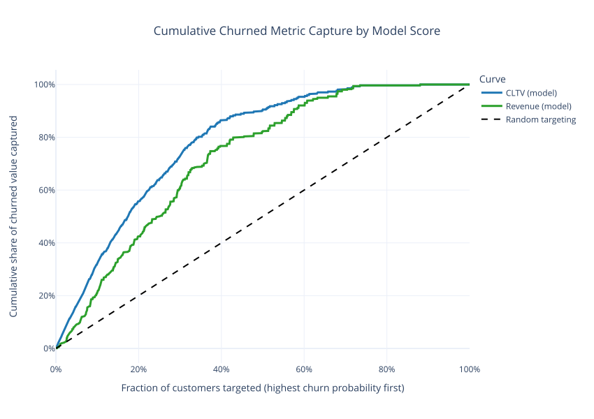
*Cumulative churn captured.*

---

## ⭐ Key Takeaways

- The project is an end-to-end churn decision workflow. 
- Contract type, offer type, and internet/service configuration are among the strongest churn-associated variables in the exploratory analysis. 
- CatBoost is the best-performing validation model in the displayed shortlist. 
- Threshold selection materially changes customer-flag volume and therefore changes operational feasibility. 
- The business-value sensitivity layer makes the work more decision-oriented.

---

## 📄 License

This project is provided under the MIT License. See LICENSE file for details.

---

## 👤 Author

### Prithvi Raj Singh

#### GitHub: [@PRSPrithvi](https://github.com/PRSPrithvi)
#### LinkedIn: [Prithvi Raj Singh](https://www.linkedin.com/in/prithvi-raj-singh-b91247235)
#### Email: prithvi020536@gmail.com

---

## 🙏 Acknowledgments

- Dataset source: [Kaggle](https://www.kaggle.com/datasets/alfathterry/telco-customer-churn-11-1-3/data)
- Thanks to the scikit-learn community for excellent documentation


---

## 📚 References

1. Scikit-learn Documentation: https://scikit-learn.org/
2. Pandas Documentation: https://pandas.pydata.org/docs/user_guide/index.html
3. Seaborn Documentation: https://seaborn.pydata.org/
4. Kaggle: https://www.kaggle.com/datasets/alfathterry/telco-customer-churn-11-1-3/data
5. Plotly Documentation: https://plotly.com/python/
